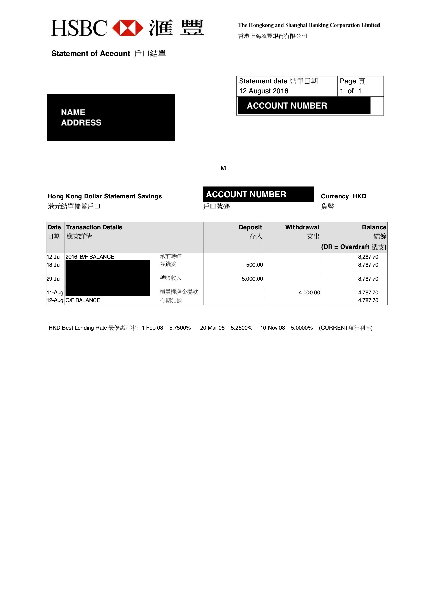
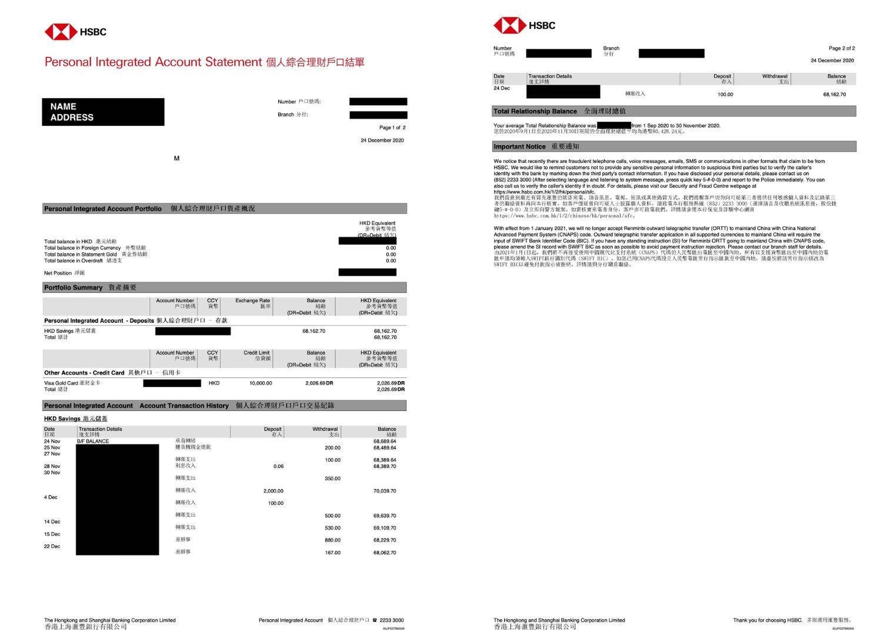

# HSBC Bank Statement Converter

This repository holds Python Notebook scripts to convert HSBC bank statements into CSV files. To generate a CSV file for your statements, simply put your e-bank statements into the `statements` directory. You can find example templates of statements that have been used to test these scripts in the  directory.

All statements that go into the `statements` directory must follow the following naming convention:
`YYYY-MM.pdf`

Once all the script finishes running within a notebook, a `statement.csv` file will be generated at root. Your statement information would also all be saved into a dataframe variable `df`, which you can manipulate even after the run.

## Single Page Converter: sp_converter.ipynb

This script is currently only capable of converting statements that follow the . While these statements can have multiple pages, this script will only look at transactions within the first page.

### How does it work?

**Slicing**
Using `pdfplumber`, text is extracted from the pdf on a line by line basis. This script will then slice the text starting from the first instance `B/F BALANCE` is mentioned in a line until `C/F BALANCE` is mentioned, as it was observed that all statements following this template begin and end with `B/F BALANCE` and `C/F BALANCE`.

**Algorithm**
As mentioned, the text extracted is formatted on a line by line basis, with entries in the transactions table also organised by row.

An entry can follow the following format:
`| Date | Details | Amount (Withdraw/Deposit) | Balance |`

It is observed that when multiple transactions are done on the same day, the row will not include a date and it will be the final transaction of that day that will hold the final balance, hence this algorithm holds the previous balance and takes into account rows below it before an entry is made into the `statement_dict`.

## Multi-Page Converter: mp_converter.ipynb

This script is capable of converting statements that hold multiple pages, but following the structure of integrated statements, as shown in .

### How does it work?

**Slicing**
This script iterates through the different pages of the statement and then combines all of the text into a single variable. It is then sliced according to the first instance `B/F BALANCE` is mentioned, as it was observed that the transaction table always starts with this line, until `HKD Current` is mentioned or `Total Relationship Balance` from the bottom.

The slicing also includes removing extra details from the footer and header of the page, including the mention of the date, page details, branch number, etc.. To do this, it looks for if there is a mention of the bank in the middle of the statement slice and looks for another mention of the Date, which is part of the header of the table on a new page.

**Algorithm**
The text that is finally extracted and sliced follows the format of the Single Page Converter, with minor differences such as:

1. The date is formatted as 'DD MMM', instead of 'DD-MMM', which needed to be adjusted so that the Single Page Converter date functions could be reused.
2. Instead of putting the Deposit/Withdraw amount on the last line of the transaction entry, it was added at the beginning.

Due to point 2, it was then observed that each entry would always take 2 lines max if the entry details were too long, hence the algorithm had to be adjusted to add to `statement_dict` first _unless_ the next line had no date and extra transaction amounts. This differs from the Single Page Converter approach in the fact that this algorithm aims to add to the dict first and then check instead of check and then add.

## Script Limitations

**Unable to differentiate between withdrawal**
Currently, both Deposit and Withdrawal amounts are combined under the same column: `Amount`, as there is currently no way for the current algorithm to differentiate between the two. This is due to the extraction process putting the values of a row all into one since the delineator between a deposit and withdraw is always a space, whereas a balance can always be identified as the last number next to another number or when the entry is the `C/F BALANCE`.

Furthermore, since multi-day transactions only show the balance at the end of the day instead of it being recalculated after each transaction, simply comparing the final end of day balance to the amount deposited/withdrawn will not work. A more advanced algorithm needs to be created to allow for the calculation of which amounts are supposed to be added/subtracted to get to the final value.

This repository will be open to any contributions that could get these scripts to overcome this limitation.
